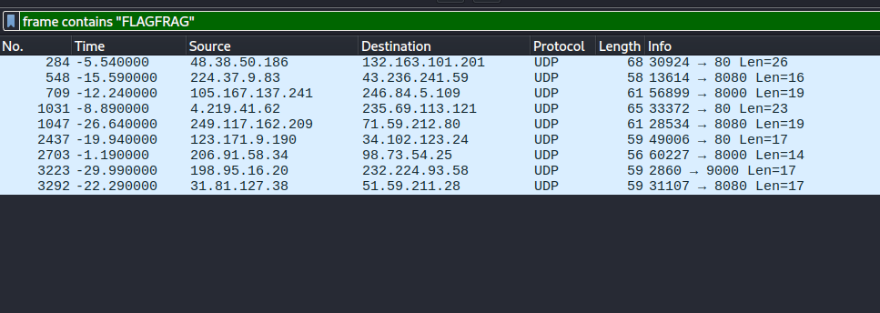
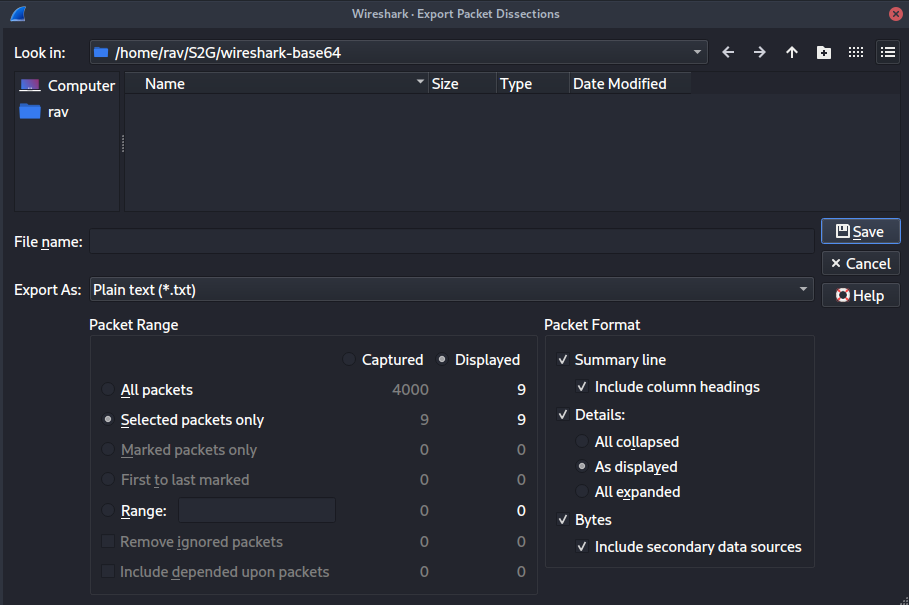

# Spaghetti - Writeup

**Flag:** `S2G{shark_in_the_packets_hide_and_seek}`

## Approach

The capture is full of noise, so filter for the marker string first:

```
frame contains "FLAGFRAG"
```



Select all matching frames, then go to **File > Export Packet Dissection >
As Plain Text**, applying the settings below so only the relevant fields are
included:



Each matching frame contains a fragment shaped like:

```
FLAGFRAG:<base64-chunk>:<base64-chunk>
```

The flag is base64-encoded and split across the fragments between the colons:

```
FLAGFRAG:UzJHe3:z
FLAGFRAG:NoYXJr:lrj
FLAGFRAG:RoZV9w:a
FLAGFRAG:ZGVfYW:3k4659f
FLAGFRAG:RzX2hp:2zk
FLAGFRAG:X2luX3:p
FLAGFRAG:5kX3Nl:vdq890xxzc
FLAGFRAG:YWNrZX:
FLAGFRAG:ZWt9:
```

Sort the fragments by packet time and concatenate them in order:

```
UzJHe3NoYXJrX2luX3RoZV9wYWNrZXRzX2hpZGVfYW5kX3NlZWt9
```

Base64-decoding that string gives the flag.
